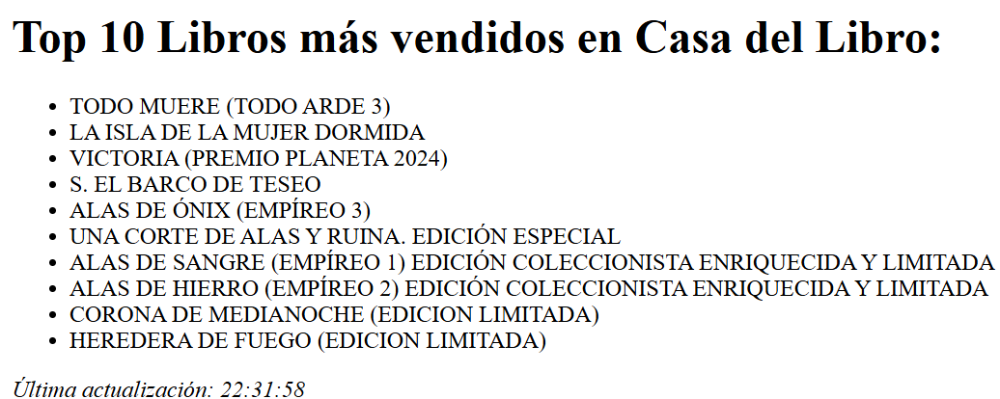

#Servidor web scraping de la página de la Casa del Libro
- Cada 10 segundos se actualizan los libros (lo más relevante sería que se ejecutase cada 24 horas, pero así compruebo su correcto funcionamiento)
- Se muestra por HTML y consola los resultados del libros, junto a la última hora de actualización
